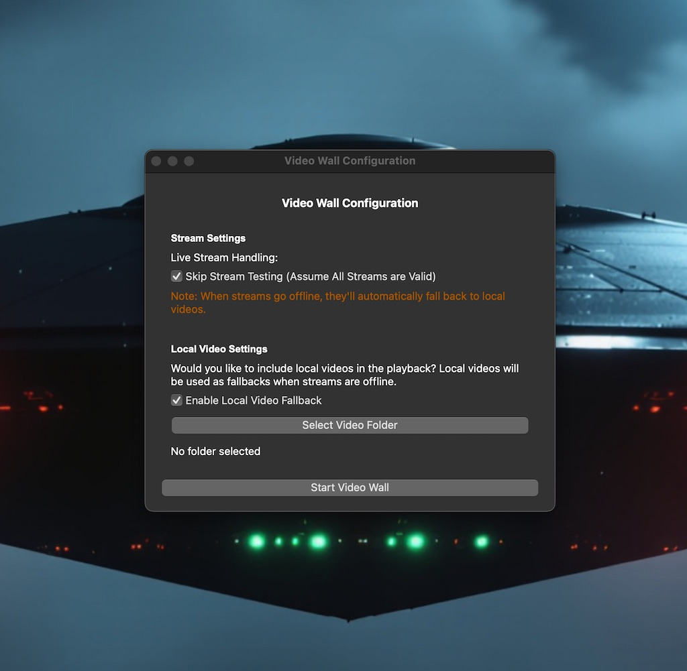

# Video Wall 🎬

> Multi-display video wall application with hardware acceleration and professional layouts


[](https://opensource.org/licenses/MIT)
[](https://www.python.org/)
[](https://www.riverbankcomputing.com/software/pyqt/)
[](https://github.com/sanchez314c/video-wall/releases)

## 📸 Main Interface



> The Ultimate Multi-Display Video Solution - Create Professional Video Walls with Ease

Video Wall is a sophisticated multi-display video wall application built with PyQt5, designed for creating hardware-accelerated video installations on macOS and Linux. The application supports both M3U8 streaming and local video playback across multiple monitors with professional-grade features and animated layouts.

## ✨ Features

- 🎬 **Multi-Video Playback** - Display up to 15 simultaneous videos with hardware acceleration
- 🖥️ **Multi-Monitor Support** - Automatic detection and spanning across all connected displays
- 🎨 **Dynamic Layouts** - Smooth animated transitions between professional layout patterns
- 🌐 **Streaming Support** - M3U8/HLS streaming with automatic local fallback
- 🎭 **Animation System** - Professional transitions with configurable timing
- ⚡ **Hardware Acceleration** - Metal (macOS), VAAPI/VDPAU (Linux) support
- 📊 **Real-time Monitoring** - Stream health tracking and performance metrics
- 🔧 **Professional Configuration** - Extensive customization options
- 🎯 **Grid Control** - Customizable grid sizes and arrangements
- 🌟 **Zero Configuration** - Works out of the box with sensible defaults

## 📸 Screenshots

<details>
<summary>View Screenshots</summary>

*Multiple video wall layouts showing grid, feature, and animated configurations*

</details>

## 🚀 Quick Start - One-Command Setup

### Option 1: Quick Installation (Recommended)

```bash
# Clone and setup
git clone https://github.com/sanchez314c/video-wall.git
cd video-wall

# Create virtual environment and install dependencies
python3 -m venv venv
source venv/bin/activate  # On Windows: venv\Scripts\activate
pip install -r requirements.txt

# Run the application
python -m src
```

That's it! Video Wall will start and automatically detect all connected displays.

### Option 2: Development Mode

```bash
# Run with debug overlay
python -m src --debug

# Run with hardware acceleration
python -m src --hwa-enabled

# Custom configuration
python -m src --grid-rows 2 --grid-cols 2
```

### Configuration Options

```bash
# Specify video folder
python -m src --video-path /path/to/videos

# Custom grid size
python -m src --grid-rows 3 --grid-cols 3

# Enable all features
python -m src --hwa-enabled --debug --fullscreen
```

## 📋 Prerequisites

For running from source:
- **Python** 3.8+
- **pip** (Python package manager)
- **Git** (for cloning)
- **Graphics**: Hardware acceleration support recommended
- **Memory**: 4GB RAM minimum (8GB+ recommended)

The application will work on most systems without additional dependencies.

## 🛠️ Installation

### Detailed Installation

```bash
# 1. Clone the repository
git clone https://github.com/sanchez314c/video-wall.git
cd video-wall

# 2. Create virtual environment
python3 -m venv venv
source venv/bin/activate  # On Windows: venv\Scripts\activate

# 3. Install dependencies
pip install -r requirements.txt

# 4. Run the application
python -m src
```

### First Time Setup

1. **Add Videos**: Place video files in any accessible folder
2. **Configure Streams**: Edit `config/m3u8-hosts.m3u8` for streaming sources
3. **Run Application**: `python -m src`
4. **Enjoy**: Videos will automatically load and play with animated layouts

### System Packages

```bash
# Ubuntu/Debian
sudo apt update
sudo apt install python3 python3-pip python3-venv

# CentOS/RHEL/Fedora
sudo dnf install python3 python3-pip

# macOS (using Homebrew)
brew install python3
```

## 📖 Usage

### 1. Starting the Application

```bash
# Basic startup
python -m src

# With hardware acceleration
python -m src --hwa-enabled

# Debug mode with status overlay
python -m src --debug
```

### 2. Keyboard Shortcuts

- **→** (Right Arrow): Manual refresh with new layout
- **Esc**: Exit fullscreen / Quit application
- **F11**: Toggle fullscreen
- **Ctrl+Q**: Quit application
- **D**: Toggle debug overlay (when in debug mode)

### 3. Layout Patterns

Video Wall features professional layout animations that cycle every 8 seconds:

- **Grid Layout**: Traditional video grid (3x3, 4x4, etc.)
- **Feature Layout**: One large video with smaller tiles
- **Columns**: Vertical column arrangements
- **Rows**: Horizontal row arrangements
- **Spiral**: Spiral pattern animations
- **Diagonal**: Diagonal arrangements
- **Random**: Dynamic positioning with smooth transitions

### 4. Adding Video Sources

**Local Videos:**
```bash
# Specify video folder
python -m src --video-path /path/to/your/videos
```

**Streaming Sources:**
Edit `config/m3u8-hosts.m3u8`:
```
# Add streaming URLs (one per line)
https://example.com/stream1.m3u8
https://example.com/stream2.m3u8
```

## 🔧 Configuration

### Basic Configuration

Edit `src/config/settings.py`:

```python
# Grid size
DEFAULT_GRID_ROWS = 3
DEFAULT_GRID_COLS = 3

# Animation timing
ANIMATION_DURATION_MS = 8000  # Layout change interval

# Performance settings
VIDEO_BUFFER_SIZE = 15000  # Buffer size in milliseconds
MAX_ACTIVE_PLAYERS = 15     # Maximum concurrent videos
```

### Advanced Configuration

- **Hardware Acceleration**: Automatically detects and uses Metal/VAAPI
- **Stream Timeout**: Configure fallback behavior for failed streams
- **Video Formats**: Support for MP4, AVI, MOV, M3U8, and more
- **Performance Tuning**: Adjustable buffer sizes and concurrent players

## 🐛 Troubleshooting

### Common Issues

<details>
<summary>Python not found</summary>

Install Python 3.8+:
```bash
# macOS
brew install python3

# Ubuntu/Debian
sudo apt update
sudo apt install python3 python3-pip

# Windows
# Download from https://python.org/
```
</details>

<details>
<summary>Dependencies not installing</summary>

Try installing with system packages:
```bash
# Ubuntu/Debian
sudo apt install python3-pyqt5 python3-opencv

# macOS
pip install PyQt5 opencv-python

# Upgrade pip first
pip install --upgrade pip
```
</details>

<details>
<summary>Videos not playing</summary>

1. Check video format is supported (MP4, AVI, MOV recommended)
2. Ensure sufficient disk space and RAM
3. Try with hardware acceleration: `python -m src --hwa-enabled`
4. Check debug output: `python -m src --debug`
</details>

<details>
<summary>Multi-monitor not working</summary>

1. Ensure all monitors are connected and detected by OS
2. Check display settings in system preferences
3. Try running in windowed mode first: `python -m src --no-fullscreen`
4. Verify display arrangement in system settings
</details>

## 📁 Project Structure

```
video-wall/
├── src/                      # Source code
│   ├── core/                # Core application logic
│   │   ├── video_player.py  # Video playback engine
│   │   ├── layout_manager.py # Layout animations
│   │   └── stream_handler.py # M3U8 streaming
│   ├── ui/                  # User interface components
│   │   ├── main_window.py   # Main application window
│   │   └── video_widget.py  # Video display widgets
│   ├── utils/               # Utility functions
│   └── config/              # Configuration modules
├── config/                  # Configuration files
│   ├── settings.py          # Application settings
│   └── m3u8-hosts.m3u8      # Streaming sources
├── docs/                    # Comprehensive documentation
├── scripts/                 # Build and utility scripts
├── build_resources/         # Build assets and screenshots
│   ├── icons/              # Platform-specific icons
│   └── screenshots/        # Application screenshots
├── tests/                   # Test suite
├── requirements.txt         # Python dependencies
├── requirements-dev.txt     # Development dependencies
├── VideoWall.spec          # PyInstaller configuration
└── README.md               # This file
```

## 🚀 Performance Tips

### Optimize Video Playback
- Enable hardware acceleration: `python -m src --hwa-enabled`
- Use H.264 encoded videos for best compatibility
- Lower video resolution (720p) for better performance
- Store videos locally (not network drives)

### System Optimization
- Close unnecessary applications
- Ensure sufficient RAM (8GB+ recommended)
- Update graphics drivers
- Use SSD storage for video files

## 🤝 Contributing

Contributions are welcome! Please feel free to submit pull requests or create issues for bug reports and feature requests.

### Development Setup

```bash
# Clone the repo
git clone https://github.com/sanchez314c/video-wall.git
cd video-wall

# Install dependencies
pip install -r requirements.txt
pip install -r requirements-dev.txt

# Run tests
pytest

# Code formatting
black src/
isort src/

# Linting
pylint src/
```

### Build Application

```bash
# macOS
pyinstaller VideoWall.spec --clean --noconfirm

# Linux
python -m PyInstaller --onedir --windowed src/main.py

# Create distributable
python -m PyInstaller --onefile --windowed src/main.py
```

## 📄 License

This project is licensed under the MIT License - see the [LICENSE](LICENSE) file for details.

## 🙏 Acknowledgments

- [PyQt5](https://www.riverbankcomputing.com/software/pyqt/) - For robust multimedia framework
- [Qt Community](https://www.qt.io/) - For excellent documentation and tools
- [FFmpeg](https://ffmpeg.org/) - For video codec support
- [OpenCV](https://opencv.org/) - For computer vision and video processing
- The open-source community for making these incredible tools available

## 🔗 Links

- [Report Issues](https://github.com/sanchez314c/video-wall/issues)
- [Request Features](https://github.com/sanchez314c/video-wall/issues/new?labels=enhancement)
- [Discussions](https://github.com/sanchez314c/video-wall/discussions)
- [Documentation](docs/)

---

**Video Wall v2.0** - Professional Multi-Display Video Solutions
Built with AI! 🚀