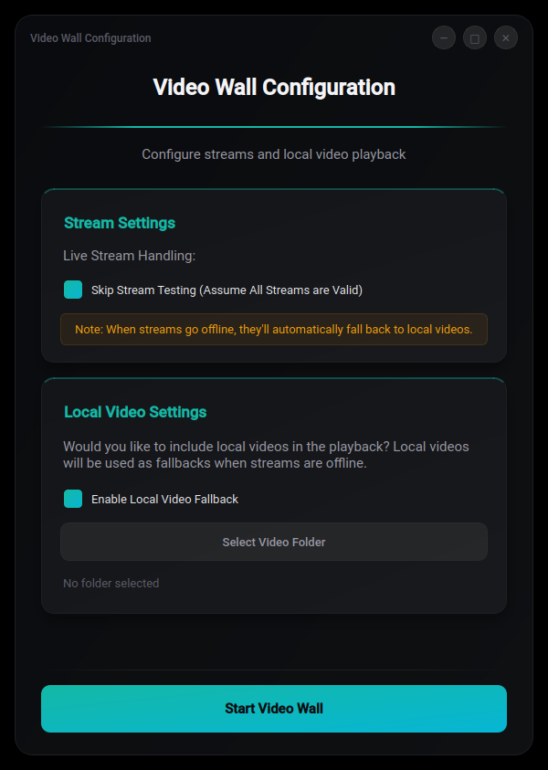

# Video Wall

A multi-display video wall application built with Python and PyQt5. Plays M3U8 streams and local videos across one or more monitors simultaneously, with automatic layout cycling, stream health monitoring, and screen recording.


[](https://opensource.org/licenses/MIT)
[](https://www.python.org/)
[](https://www.riverbankcomputing.com/software/pyqt/)
[](https://github.com/sanchez314c/video-wall/releases)



## What It Does

Video Wall fills every connected display with a grid of video tiles. Each tile plays a unique stream from your M3U8 playlist. When a stream fails or times out, the tile automatically falls back to a local video file. Layouts cycle automatically every 5-30 seconds — tiles resize, rearrange, and swap positions using smooth Qt property animations.

You get 6 to 12 tiles visible at any time (configurable), pulled from a 4x4 grid pool. The app runs fullscreen on all connected monitors, each as a separate `VideoWall` window instance.

## Features

- **Multi-monitor support** — spawns one fullscreen window per detected display
- **Simultaneous streams** — up to 15 concurrent M3U8/HLS players
- **Auto layout cycling** — 6 layout patterns (varied, feature, columns, rows, mixed, asymmetric) that rotate automatically
- **Animated tile transitions** — smooth geometry animations using Qt's `QPropertyAnimation` with easing curves
- **Stream fallback** — tiles that timeout or error automatically switch to local video
- **Screen recording** — built-in ffmpeg x11grab recorder, toggle with `R` key, saves timestamped MP4s to Desktop
- **Dark Neo Glass UI** — fully themed with a void-black/teal design system, including a custom frameless config dialog
- **Hardware acceleration flag** — pass `--hwa-enabled` to hint Qt multimedia backend to use platform decoders
- **GStreamer path detection** — on Linux, auto-discovers system GStreamer plugin paths for packaged binaries

## Tech Stack

- **Python 3.8+**
- **PyQt5** (5.15+) — Qt multimedia, widgets, animations
- **Qt Multimedia / QMediaPlayer** — video playback engine
- **GStreamer** — Linux video backend (system-installed)
- **ffmpeg** — screen recording via x11grab (Linux)
- **PyInstaller** — standalone binary builds

No OpenCV, no FFmpeg Python bindings, no Node/Electron. Pure Python + Qt.

## Quick Start

```bash
git clone https://github.com/sanchez314c/video-wall.git
cd video-wall
pip install -r requirements.txt
./run-source-linux.sh
```

Or on macOS:
```bash
./run-source-macos.sh
```

Or directly:
```bash
python -m src.core.app
```

With hardware acceleration:
```bash
python -m src.core.app --hwa-enabled
```

## Installation

### From Source

**Requirements:** Python 3.8+, PyQt5 5.15+, GStreamer 1.0 (Linux)

```bash
# Ubuntu/Debian
sudo apt install python3 python3-pip python3-pyqt5 gstreamer1.0-plugins-base gstreamer1.0-plugins-good

# macOS
brew install python3
pip install PyQt5

# Install Python dependencies
pip install -r requirements.txt
```

### Pre-built Binary (Linux)

A PyInstaller-built binary is available at `dist/VideoWall/VideoWall`. Install it system-wide:

```bash
sudo cp -r dist/VideoWall /opt/VideoWall
sudo ln -s /opt/VideoWall/VideoWall /usr/local/bin/videowall
```

A `.desktop` entry for app launcher integration can be created at `/usr/share/applications/videowall.desktop`.

## Configuration

### Stream Sources

Edit `m3u8-hosts.m3u8` in the project root. Add one M3U8 URL per line, lines starting with `#` are ignored:

```
# My streams
https://example.com/stream1.m3u8
https://example.com/stream2.m3u8
```

### Application Settings

Edit `src/config/settings.py`:

| Setting | Default | Description |
|---|---|---|
| `DEFAULT_GRID_ROWS` | 4 | Grid rows |
| `DEFAULT_GRID_COLS` | 4 | Grid columns |
| `MIN_VISIBLE_TILES` | 6 | Minimum tiles shown at once |
| `MAX_VISIBLE_TILES` | 12 | Maximum tiles shown at once |
| `MAX_ACTIVE_PLAYERS` | 15 | Max concurrent media players |
| `ANIMATION_DURATION_MS` | 8000 | Tile swap animation duration (ms) |
| `STREAM_CHECK_INTERVAL_MS` | 30000 | Stream health check interval (ms) |
| `VIDEO_LOADING_TIMEOUT_MS` | 15000 | Timeout before fallback (ms) |

### Startup Dialog

On launch, a config dialog lets you:
- Skip stream pre-testing (recommended for faster startup)
- Enable local video fallback and select a folder
- Enable auto-recording to Desktop on start

## Usage

### Keyboard Shortcuts

| Key | Action |
|---|---|
| Right Arrow | Manual layout refresh |
| `R` | Toggle screen recording |
| `F11` or `Alt+F` | Toggle fullscreen |
| `Esc` | Exit fullscreen / quit |
| `Ctrl+Q` | Quit |

### Layout Patterns

The animator cycles through these patterns automatically:

- **Varied** — mix of 1x1, 1x2, 2x1, and 2x2 tiles
- **Feature** — one 2x2 tile dominates, rest fill around it
- **Columns** — tall 2x1 tiles, no wide spans
- **Rows** — wide 1x2 tiles, no tall spans
- **Mixed** — medium variety, 2x2 + mixed spans
- **Asymmetric** — offset arrangement with varied sizes

The animator fires every 5, 15, or 30 seconds (randomly chosen). 90% of transitions are layout reshuffles; 10% are animated tile swaps.

### Screen Recording

Press `R` to start recording. A blinking red REC indicator appears in the top-left corner. Press `R` again to stop. Files save to `~/Desktop/VideoWall-Recording-YYYYMMDD_HHMMSS.mp4`.

Requires `ffmpeg` installed and `DISPLAY` environment variable set (Linux x11grab).

## Project Structure

```
video-wall/
├── src/
│   ├── main.py                   # Module entry point
│   ├── core/
│   │   ├── app.py                # App init, argument parsing, screen spawning
│   │   ├── video_wall.py         # Main window, keyboard handling, timers
│   │   ├── display_manager.py    # Grid layout, tile creation, fullscreen toggle
│   │   ├── video_manager.py      # Player lifecycle, stream/fallback logic
│   │   ├── video_loader.py       # Media loading, GPU detection, player config
│   │   ├── layout_manager.py     # Layout pattern application and tile placement
│   │   ├── animator.py           # QPropertyAnimation controller, transition scheduler
│   │   ├── stream_tracker.py     # Multi-monitor stream distribution
│   │   └── recorder.py           # ffmpeg screen recorder, blinking indicator
│   ├── ui/
│   │   ├── video_tile.py         # QVideoWidget with status/loading overlays
│   │   ├── dialogs.py            # Startup config dialog (frameless, Dark Neo Glass)
│   │   ├── status_overlay.py     # Status overlay widget
│   │   └── theme.py              # Full design token system + QSS stylesheets
│   ├── utils/
│   │   ├── file_utils.py         # M3U8 parsing, recursive video file scanning
│   │   └── stream_utils.py       # Stream validation, retry backoff utilities
│   └── config/
│       └── settings.py           # All app-wide constants
├── m3u8-hosts.m3u8               # Stream playlist (add your URLs here)
├── resources/                    # Icons and screenshots
├── scripts/
│   └── qt_plugin_path_hook.py    # PyInstaller runtime hook for GStreamer paths
├── VideoWall.spec                # PyInstaller build spec
├── requirements.txt              # Runtime dependencies
├── requirements-dev.txt          # Dev/test dependencies
├── run-source-linux.sh           # Linux launch script
├── run-source-macos.sh           # macOS launch script
└── docs/                         # Extended documentation
```

## Building a Binary

```bash
# Install build deps
pip install pyinstaller

# Build (Linux/macOS)
pyinstaller VideoWall.spec --clean --noconfirm

# Binary lands in dist/VideoWall/VideoWall
```

The spec bundles `m3u8-hosts.m3u8` and the `resources/` directory. The `scripts/qt_plugin_path_hook.py` runtime hook sets GStreamer paths so the packaged binary finds system decoders on Linux.

## Troubleshooting

**Videos stuck on "Loading" in packaged binary (Linux)**
The binary needs system GStreamer plugins. Make sure these are installed:
```bash
sudo apt install gstreamer1.0-plugins-base gstreamer1.0-plugins-good gstreamer1.0-plugins-bad gstreamer1.0-libav
```

**No streams loading**
Check that URLs in `m3u8-hosts.m3u8` are valid and reachable. Try running with the "Skip Stream Testing" option unchecked to see validation output.

**Multi-monitor not working**
Make sure all monitors are active and detected by the OS before launching. The app reads `QApplication.screens()` at startup — monitors connected after launch won't be picked up.

**Screen recording fails**
Requires `ffmpeg` on PATH and a valid `DISPLAY` environment variable. Not supported on Wayland (x11grab is X11-only).

## License

MIT — see [LICENSE](LICENSE) for details.
