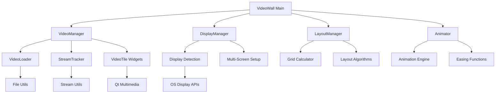

# VideoWall Architecture Documentation

## Table of Contents
- [System Overview](#system-overview)
- [Architecture Principles](#architecture-principles)
- [Component Architecture](#component-architecture)
- [Design Patterns](#design-patterns)
- [Data Flow](#data-flow)
- [Technology Stack](#technology-stack)
- [Performance Considerations](#performance-considerations)
- [Security Architecture](#security-architecture)
- [Scalability Design](#scalability-design)

## System Overview

VideoWall is a multi-display video wall application built with PyQt5, designed to create hardware-accelerated video installations. The system supports both local video playback and M3U8 streaming across multiple monitors with dynamic animated layouts.

### Core Capabilities
- **Multi-Monitor Support**: Automatic detection and spanning across all displays
- **Video Playback**: Hardware-accelerated decoding for multiple simultaneous streams
- **Streaming Support**: M3U8/HLS streaming with automatic fallback
- **Dynamic Layouts**: Animated transitions between different grid arrangements
- **Real-time Monitoring**: Stream health tracking and performance metrics

### High-Level Architecture
```
┌─────────────────────────────────────────────────────────────┐
│                    VideoWall Application                   │
├─────────────────────────────────────────────────────────────┤
│  UI Layer (PyQt5 Widgets)                                │
│  ┌─────────────┐ ┌─────────────┐ ┌─────────────┐        │
│  │ Video Tiles │ │ Status Bar  │ │ Dialogs     │        │
│  └─────────────┘ └─────────────┘ └─────────────┘        │
├─────────────────────────────────────────────────────────────┤
│  Core Application Layer                                   │
│  ┌─────────────┐ ┌─────────────┐ ┌─────────────┐        │
│  │VideoManager │ │DisplayMgr   │ │LayoutMgr    │        │
│  └─────────────┘ └─────────────┘ └─────────────┘        │
│  ┌─────────────┐ ┌─────────────┐ ┌─────────────┐        │
│  │ Animator    │ │StreamTrack  │ │VideoLoader  │        │
│  └─────────────┘ └─────────────┘ └─────────────┘        │
├─────────────────────────────────────────────────────────────┤
│  Utility Layer                                           │
│  ┌─────────────┐ ┌─────────────┐ ┌─────────────┐        │
│  │ FileUtils   │ │StreamUtils  │ │Settings     │        │
│  └─────────────┘ └─────────────┘ └─────────────┘        │
├─────────────────────────────────────────────────────────────┤
│  System Layer (Qt Multimedia, OS APIs)                    │
└─────────────────────────────────────────────────────────────┘
```

## Architecture Principles

### 1. Separation of Concerns
Each component has a single, well-defined responsibility:
- **UI Components**: Handle user interaction and display
- **Core Logic**: Manage application state and business rules
- **Utilities**: Provide reusable functionality
- **System Interface**: Abstract platform-specific details

### 2. Modularity
The application is organized into independent modules:
- Loose coupling between components
- Well-defined interfaces
- Dependency injection where appropriate
- Easy to test and maintain

### 3. Extensibility
The architecture supports future enhancements:
- Plugin system for video effects
- Configurable layout algorithms
- Extensible streaming protocols
- Themeable UI components

### 4. Performance First
Design decisions prioritize performance:
- Hardware acceleration where available
- Efficient memory management
- Asynchronous operations
- Resource pooling

## Component Architecture

### VideoWall (`src/core/video_wall.py`)

**Purpose**: Main application window and central coordinator

**Responsibilities**:
- Application lifecycle management
- Component initialization and coordination
- Global event handling
- UI layout management

**Key Methods**:
```python
class VideoWall(QMainWindow):
    def __init__(self):
        """Initialize main application window"""
        
    def setup_ui(self):
        """Setup user interface components"""
        
    def handle_display_change(self):
        """Handle display configuration changes"""
        
    def closeEvent(self, event):
        """Clean shutdown handling"""
```

### VideoManager (`src/core/video_manager.py`)

**Purpose**: Multi-video playback coordination and management

**Responsibilities**:
- Video player instance management
- Playback synchronization
- Stream fallback handling
- Resource allocation

**Key Features**:
- Up to 15 simultaneous video players
- Hardware-accelerated decoding
- Automatic stream switching
- Memory-efficient buffering

### DisplayManager (`src/core/display_manager.py`)

**Purpose**: Multi-monitor detection and configuration

**Responsibilities**:
- Display detection and enumeration
- Display arrangement calculation
- Display change event handling
- Multi-screen spanning

**Platform Support**:
- macOS: CoreGraphics display detection
- Linux: X11/RandR display management
- Automatic DPI scaling

### LayoutManager (`src/core/layout_manager.py`)

**Purpose**: Dynamic grid layout and positioning logic

**Responsibilities**:
- Grid position calculation
- Layout transition management
- Animation coordination
- Layout algorithm implementation

**Layout Patterns**:
- Grid (traditional 3x3)
- Feature (one large, multiple small)
- Columns and rows
- Spiral and diagonal
- Random positioning

### Animator (`src/core/animator.py`)

**Purpose**: Smooth animation and transition effects

**Responsibilities**:
- Animation timing management
- Easing function implementation
- Transition coordination
- Performance optimization

**Animation Types**:
- Position transitions
- Scale transformations
- Opacity fades
- Rotation effects

### VideoLoader (`src/core/video_loader.py`)

**Purpose**: Video file loading and caching system

**Responsibilities**:
- File format validation
- Metadata extraction
- Thumbnail generation
- Cache management

**Supported Formats**:
- MP4, WebM, MOV, AVI, MKV
- Hardware-accelerated codecs
- Streaming protocols

### StreamTracker (`src/core/stream_tracker.py`)

**Purpose**: M3U8 stream monitoring with fallback handling

**Responsibilities**:
- Stream health monitoring
- Automatic fallback switching
- Performance metrics collection
- Error recovery

## Design Patterns

### 1. Observer Pattern
**Used for**: Stream status updates, display change notifications

```python
class StreamTracker:
    def __init__(self):
        self.observers = []
        
    def add_observer(self, observer):
        self.observers.append(observer)
        
    def notify_observers(self, status):
        for observer in self.observers:
            observer.on_stream_status_change(status)
```

### 2. Factory Pattern
**Used for**: Video tile creation based on content type

```python
class VideoTileFactory:
    @staticmethod
    def create_tile(content_type, source):
        if content_type == 'local':
            return LocalVideoTile(source)
        elif content_type == 'stream':
            return StreamVideoTile(source)
        else:
            raise ValueError(f"Unsupported content type: {content_type}")
```

### 3. Strategy Pattern
**Used for**: Different playback strategies for local vs streaming

```python
class PlaybackStrategy:
    def play(self, source):
        raise NotImplementedError

class LocalPlaybackStrategy(PlaybackStrategy):
    def play(self, source):
        # Local file playback logic
        pass

class StreamPlaybackStrategy(PlaybackStrategy):
    def play(self, source):
        # Stream playback logic
        pass
```

### 4. Singleton Pattern
**Used for**: Display manager, configuration manager

```python
class DisplayManager:
    _instance = None
    
    def __new__(cls):
        if cls._instance is None:
            cls._instance = super().__new__(cls)
        return cls._instance
```

## Data Flow

### Video Playback Flow
```
┌─────────────┐    ┌─────────────┐    ┌─────────────┐
│   Source    │───▶│ VideoLoader │───▶│VideoManager│
│ (Local/Stream)│    │             │    │             │
└─────────────┘    └─────────────┘    └─────────────┘
                                             │
                                             ▼
┌─────────────┐    ┌─────────────┐    ┌─────────────┐
│   Display   │◀───│ LayoutMgr   │◀───│ VideoTile   │
│   Manager   │    │             │    │   Widget    │
└─────────────┘    └─────────────┘    └─────────────┘
```

### Stream Monitoring Flow
```
┌─────────────┐    ┌─────────────┐    ┌─────────────┐
│ M3U8 Stream │───▶│StreamTracker│───▶│VideoManager│
│   Source    │    │             │    │             │
└─────────────┘    └─────────────┘    └─────────────┘
                      │                     │
                      ▼                     ▼
                ┌─────────────┐    ┌─────────────┐
                │   Fallback  │    │   Metrics   │
                │   Handler   │    │ Collection  │
                └─────────────┘    └─────────────┘
```

### Layout Animation Flow
```
┌─────────────┐    ┌─────────────┐    ┌─────────────┐
│   Timer     │───▶│ LayoutMgr   │───▶│  Animator   │
│   Event     │    │             │    │             │
└─────────────┘    └─────────────┘    └─────────────┘
                                           │
                                           ▼
┌─────────────┐    ┌─────────────┐    ┌─────────────┐
│   Update    │◀───│  Animation  │◀───│   Easing    │
│   Positions │    │  Frames     │    │ Functions  │
└─────────────┘    └─────────────┘    └─────────────┘
```

## Technology Stack

### Core Framework
- **PyQt5**: GUI framework and multimedia support
- **Python 3.8+**: Core language and runtime
- **Qt Multimedia**: Hardware-accelerated video playback

### Platform Integration
- **macOS**: CoreGraphics, Metal framework
- **Linux**: X11, GStreamer, VAAPI/VDPAU

### Build and Distribution
- **PyInstaller**: Cross-platform application packaging
- **Docker**: Containerized deployment
- **GitHub Actions**: CI/CD pipeline

### Development Tools
- **pytest**: Testing framework
- **pylint**: Code quality analysis
- **black**: Code formatting
- **mypy**: Type checking

## Performance Considerations

### Memory Management
- **Video Buffering**: Configurable buffer size (default 15 seconds)
- **Player Pooling**: Reuse player instances to reduce overhead
- **Garbage Collection**: Explicit cleanup of video resources
- **Memory Monitoring**: Track and limit memory usage

### CPU Optimization
- **Hardware Acceleration**: GPU-based video decoding
- **Asynchronous Loading**: Non-blocking video loading
- **Efficient Layouts**: Optimized position calculations
- **Frame Rate Limiting**: Cap animation frame rates

### GPU Utilization
- **Hardware Decoding**: Use GPU for video decompression
- **OpenGL Integration**: Hardware-accelerated rendering
- **Shader Effects**: GPU-based video effects
- **Memory Management**: Efficient GPU memory usage

### Network Optimization
- **Stream Caching**: Local cache of streaming content
- **Adaptive Bitrate**: Adjust quality based on bandwidth
- **Connection Pooling**: Reuse network connections
- **Error Recovery**: Fast fallback to local content

## Security Architecture

### Input Validation
- **File Path Validation**: Prevent directory traversal
- **Stream URL Validation**: Validate M3U8 URLs
- **Configuration Validation**: Validate settings files
- **User Input Sanitization**: Prevent injection attacks

### Resource Isolation
- **Sandboxing**: Limit file system access
- **Network Restrictions**: Control network access
- **Memory Limits**: Prevent memory exhaustion
- **Process Isolation**: Separate processes for critical operations

### Data Protection
- **No Sensitive Data Storage**: Avoid storing credentials
- **Secure Configuration**: Protect configuration files
- **Audit Logging**: Track security-relevant events
- **Error Handling**: Avoid information disclosure

## Scalability Design

### Horizontal Scaling
- **Multi-Process Architecture**: Separate processes for video decoding
- **Load Balancing**: Distribute video processing across cores
- **Resource Management**: Dynamic resource allocation
- **Performance Monitoring**: Real-time performance metrics

### Vertical Scaling
- **Hardware Detection**: Automatic hardware capability detection
- **Adaptive Quality**: Adjust quality based on hardware
- **Resource Optimization**: Efficient resource utilization
- **Performance Tuning**: Automatic performance optimization

### Future Extensibility
- **Plugin Architecture**: Support for third-party extensions
- **API Design**: RESTful API for remote control
- **Configuration Management**: Flexible configuration system
- **Modular Design**: Easy to add new features

## Component Interaction Diagram



## Error Handling Architecture

### Exception Hierarchy
```python
class VideoWallError(Exception):
    """Base exception for VideoWall application"""
    pass

class VideoLoadError(VideoWallError):
    """Video loading failures"""
    pass

class DisplayError(VideoWallError):
    """Display configuration errors"""
    pass

class StreamError(VideoWallError):
    """Streaming related errors"""
    pass

class ConfigurationError(VideoWallError):
    """Configuration errors"""
    pass
```

### Error Recovery Strategies
- **Graceful Degradation**: Fallback to reduced functionality
- **Automatic Retry**: Retry failed operations with backoff
- **User Notification**: Clear error messages to users
- **Logging**: Comprehensive error logging for debugging

## Testing Architecture

### Test Organization
```
tests/
├── unit/                   # Unit tests
│   ├── test_video_manager.py
│   ├── test_layout_manager.py
│   └── test_animator.py
├── integration/            # Integration tests
│   ├── test_display_integration.py
│   └── test_streaming_integration.py
├── e2e/                   # End-to-end tests
│   ├── test_full_workflow.py
│   └── test_multi_display.py
└── fixtures/              # Test data
    ├── sample_videos/
    └── test_streams.m3u8
```

### Test Strategy
- **Unit Tests**: Test individual components in isolation
- **Integration Tests**: Test component interactions
- **End-to-End Tests**: Test complete user workflows
- **Performance Tests**: Validate performance requirements

## Configuration Architecture

### Settings Hierarchy
```python
# Default settings
DEFAULT_SETTINGS = {
    'grid_rows': 3,
    'grid_cols': 3,
    'animation_duration': 8000,
    'video_buffer_size': 15000,
    'max_active_players': 15
}

# User settings (overrides defaults)
USER_SETTINGS = load_user_config()

# Runtime settings (temporary overrides)
RUNTIME_SETTINGS = {}
```

### Configuration Sources
1. **Default Settings**: Built-in defaults
2. **Configuration Files**: User-editable config files
3. **Environment Variables**: Runtime configuration
4. **Command Line Arguments**: Session-specific settings

---

This architecture provides a solid foundation for the VideoWall application, ensuring maintainability, performance, and extensibility for future development.