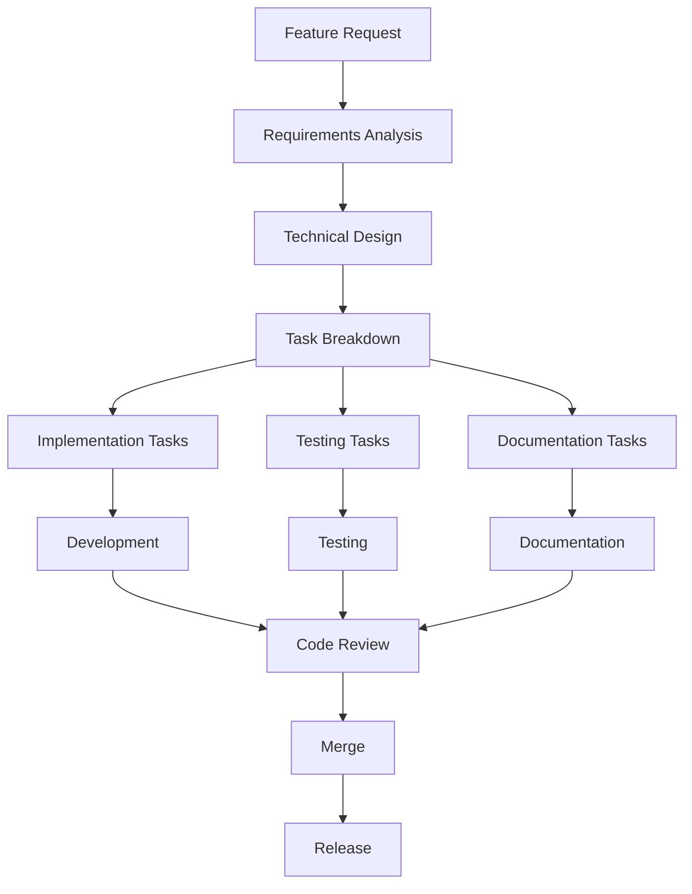
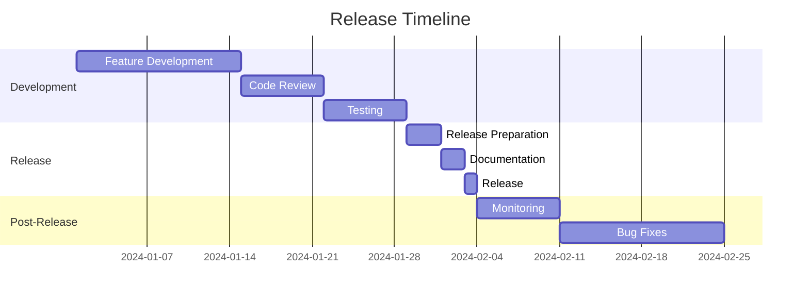

# VideoWall Development Workflow

## Table of Contents
- [Development Lifecycle](#development-lifecycle)
- [Git Workflow](#git-workflow)
- [Code Review Process](#code-review-process)
- [Testing Strategy](#testing-strategy)
- [Release Management](#release-management)
- [Issue Management](#issue-management)
- [Documentation Workflow](#documentation-workflow)
- [Quality Assurance](#quality-assurance)

## Development Lifecycle

### 1. Planning Phase

#### Feature Planning
- Create feature proposal in GitHub Discussions
- Define requirements and acceptance criteria
- Estimate effort and identify dependencies
- Assign to milestone or release

#### Technical Design
- Create technical design document
- Define API changes and data structures
- Identify impact on existing components
- Review with team members

#### Task Breakdown


### 2. Development Phase

#### Environment Setup
```bash
# Create feature branch
git checkout -b feature/new-feature-name

# Set up development environment
python -m venv venv
source venv/bin/activate
pip install -r requirements.txt
pip install -r requirements-dev.txt

# Install pre-commit hooks
pre-commit install
```

#### Development Workflow
1. **Implement feature** following coding standards
2. **Write tests** for new functionality
3. **Update documentation** as needed
4. **Run quality checks** locally
5. **Commit changes** with conventional commits
6. **Push branch** for review

### 3. Review Phase

#### Self-Review Checklist
- [ ] Code follows project standards
- [ ] Tests cover new functionality
- [ ] Documentation is updated
- [ ] No debug code or TODOs left
- [ ] Performance impact considered
- [ ] Security implications reviewed

#### Peer Review Process
1. **Create Pull Request** with detailed description
2. **Request reviews** from team members
3. **Address feedback** iteratively
4. **Update tests** based on review
5. **Final approval** from required reviewers

### 4. Integration Phase

#### Continuous Integration
```yaml
# .github/workflows/ci.yml
name: CI

on: [push, pull_request]

jobs:
  test:
    runs-on: ${{ matrix.os }}
    strategy:
      matrix:
        os: [ubuntu-latest, macos-latest]
        python-version: [3.8, 3.9, '3.10', 3.11]
        
    steps:
    - uses: actions/checkout@v3
    
    - name: Set up Python
      uses: actions/setup-python@v4
      with:
        python-version: ${{ matrix.python-version }}
        
    - name: Install dependencies
      run: |
        pip install -r requirements.txt
        pip install -r requirements-dev.txt
        
    - name: Run tests
      run: |
        pytest --cov=src --cov-report=xml
        
    - name: Run linting
      run: |
        pylint src/
        black --check src/
        
    - name: Upload coverage
      uses: codecov/codecov-action@v3
```

#### Merge Requirements
- All CI checks pass
- Required approvals received
- No merge conflicts
- Documentation updated

## Git Workflow

### Branch Strategy

#### Main Branches
- **main**: Production-ready code
- **develop**: Integration branch for features
- **release/x.y.z**: Release preparation
- **hotfix/x.y.z**: Critical fixes

#### Feature Branches
```bash
# Naming conventions
feature/video-codec-support
bugfix/memory-leak-fix
docs/api-documentation
refactor/video-manager-cleanup
release/v1.2.0
hotfix/v1.1.1
```

#### Branch Protection Rules
```yaml
# .github/branch-protection.yml
main:
  required_status_checks:
    strict: true
    contexts:
      - CI
      - CodeQL
  enforce_admins: true
  required_pull_request_reviews:
    required_approving_review_count: 2
    dismiss_stale_reviews: true
    require_code_owner_reviews: true
  restrictions:
    users: []
    teams: [core-developers]
```

### Commit Guidelines

#### Conventional Commits
```
<type>[optional scope]: <description>

[optional body]

[optional footer(s)]
```

#### Types
- **feat**: New feature
- **fix**: Bug fix
- **docs**: Documentation
- **style**: Code style (formatting, missing semicolons)
- **refactor**: Code change that neither fixes a bug nor adds a feature
- **perf**: Performance improvement
- **test**: Adding missing tests or correcting existing tests
- **chore**: Maintenance tasks

#### Examples
```
feat(video): add support for MKV format

Implement MKV container support using existing codec
infrastructure. Add file validation and metadata extraction.

Closes #123

fix(display): correct multi-monitor detection on Linux

Update X11 display detection to handle virtual displays
and rotated monitors properly.

perf(animator): optimize layout transitions

Reduce CPU usage during animations by caching calculated
positions and using efficient interpolation.

BREAKING CHANGE: Animation API updated to use new
transition system.
```

### Merge Strategy

#### Feature Branch Merge
```bash
# Squash merge for feature branches
git checkout develop
git merge --squash feature/new-feature
git commit -m "feat: implement new feature"
git branch -d feature/new-feature
```

#### Release Branch Merge
```bash
# Merge to main and develop
git checkout main
git merge --no-ff release/v1.2.0
git tag -a v1.2.0 -m "Release version 1.2.0"

git checkout develop
git merge --no-ff release/v1.2.0
git branch -d release/v1.2.0
```

## Code Review Process

### Review Guidelines

#### What to Review
- **Functionality**: Does the code work as intended?
- **Design**: Is the architecture sound?
- **Performance**: Are there performance implications?
- **Security**: Are there security vulnerabilities?
- **Testing**: Are tests adequate?
- **Documentation**: Is documentation clear?

#### Review Checklist
```markdown
## Code Review Checklist

### Functionality
- [ ] Feature works as specified
- [ ] Edge cases handled
- [ ] Error handling appropriate
- [ ] User experience considered

### Code Quality
- [ ] Code follows project standards
- [ ] Functions are small and focused
- [ ] Naming is clear and consistent
- [ ] Comments are helpful and accurate

### Testing
- [ ] Tests cover new functionality
- [ ] Tests cover edge cases
- [ ] Tests are maintainable
- [ ] Integration tests included

### Performance
- [ ] No performance regressions
- [ ] Resource usage considered
- [ ] Scalability implications addressed
- [ ] Memory leaks checked

### Security
- [ ] No sensitive data exposed
- [ ] Input validation present
- [ ] Dependencies are secure
- [ ] Permissions are appropriate
```

### Review Process Flow

1. **Initial Review**
   - Automated checks pass
   - Reviewer assigned
   - Initial feedback provided

2. **Iteration**
   - Author addresses feedback
   - Tests updated if needed
   - Documentation updated

3. **Final Review**
   - All feedback addressed
   - Approval granted
   - Merge scheduled

## Testing Strategy

### Test Pyramid

```
    E2E Tests (10%)
   ─────────────────
  Integration Tests (20%)
 ─────────────────────────
Unit Tests (70%)
```

### Test Categories

#### Unit Tests
- Test individual functions and classes
- Fast execution
- Mock external dependencies
- High coverage requirement

#### Integration Tests
- Test component interactions
- Real dependencies where possible
- Database and API integration
- Performance testing

#### End-to-End Tests
- Test complete user workflows
- Real environment simulation
- Cross-platform testing
- User acceptance testing

### Test Implementation

#### Unit Test Example
```python
# tests/unit/test_video_manager.py
import pytest
from unittest.mock import Mock, patch
from src.core.video_manager import VideoManager

class TestVideoManager:
    @pytest.fixture
    def video_manager(self):
        return VideoManager()
    
    def test_load_video_success(self, video_manager):
        """Test successful video loading."""
        video_path = "/path/to/video.mp4"
        
        with patch('src.core.video_manager.Video') as mock_video:
            video = video_manager.load_video(video_path)
            
            mock_video.assert_called_once_with(video_path)
            assert video is not None
    
    def test_load_video_file_not_found(self, video_manager):
        """Test video loading with non-existent file."""
        video_path = "/non/existent/video.mp4"
        
        with pytest.raises(FileNotFoundError):
            video_manager.load_video(video_path)
```

#### Integration Test Example
```python
# tests/integration/test_display_integration.py
import pytest
from PyQt5.QtWidgets import QApplication
from src.core.display_manager import DisplayManager

class TestDisplayIntegration:
    @pytest.fixture(scope="class")
    def app(self):
        if not QApplication.instance():
            app = QApplication([])
        else:
            app = QApplication.instance()
        yield app
        app.quit()
    
    def test_multi_display_detection(self, app):
        """Test multi-display detection."""
        dm = DisplayManager()
        displays = dm.get_displays()
        
        assert len(displays) >= 1
        for display in displays:
            assert display.width > 0
            assert display.height > 0
```

### Test Automation

#### Continuous Testing
```yaml
# .github/workflows/test.yml
name: Test

on:
  push:
    branches: [main, develop]
  pull_request:
    branches: [main, develop]

jobs:
  test:
    runs-on: ${{ matrix.os }}
    strategy:
      matrix:
        os: [ubuntu-latest, macos-latest]
        python-version: [3.8, 3.9, '3.10', 3.11]
        
    steps:
    - uses: actions/checkout@v3
    
    - name: Set up Python
      uses: actions/setup-python@v4
      with:
        python-version: ${{ matrix.python-version }}
        
    - name: Cache dependencies
      uses: actions/cache@v3
      with:
        path: ~/.cache/pip
        key: ${{ runner.os }}-pip-${{ hashFiles('**/requirements*.txt') }}
        
    - name: Install dependencies
      run: |
        pip install -r requirements.txt
        pip install -r requirements-dev.txt
        
    - name: Run unit tests
      run: |
        pytest tests/unit/ -v --cov=src --cov-report=xml
        
    - name: Run integration tests
      run: |
        pytest tests/integration/ -v
        
    - name: Run E2E tests
      run: |
        pytest tests/e2e/ -v
        
    - name: Upload coverage
      uses: codecov/codecov-action@v3
```

## Release Management

### Release Planning

#### Release Types
- **Major Release**: Breaking changes, new architecture
- **Minor Release**: New features, API additions
- **Patch Release**: Bug fixes, security updates

#### Release Timeline


### Release Process

#### Pre-Release Checklist
```markdown
## Release v1.2.0 Checklist

### Code Quality
- [ ] All tests passing
- [ ] Code coverage >= 80%
- [ ] No critical security issues
- [ ] Performance benchmarks met
- [ ] Documentation updated

### Build and Package
- [ ] macOS build successful
- [ ] Linux build successful
- [ ] Docker image built
- [ ] Installation tested
- [ ] Upgrade path tested

### Release Preparation
- [ ] Version numbers updated
- [ ] CHANGELOG.md updated
- [ ] Release notes prepared
- [ ] Migration guide (if needed)
- [ ] Security review complete
```

#### Release Steps
```bash
# 1. Create release branch
git checkout -b release/v1.2.0 develop

# 2. Update version numbers
# Update src/config/settings.py
# Update VideoWall.spec files
# Update documentation

# 3. Final testing
pytest
python -m src  # Manual testing

# 4. Prepare release
git commit -m "chore: prepare release v1.2.0"
git push origin release/v1.2.0

# 5. Create release
git checkout main
git merge --no-ff release/v1.2.0
git tag -a v1.2.0 -m "Release version 1.2.0"

# 6. Deploy
# Build and upload packages
# Update website
# Send announcements

# 7. Merge back to develop
git checkout develop
git merge --no-ff release/v1.2.0
git branch -d release/v1.2.0
```

## Issue Management

### Issue Types

#### Bug Reports
```markdown
## Bug Report Template

**Description**
Brief description of the issue

**Steps to Reproduce**
1. Go to...
2. Click on...
3. See error

**Expected Behavior**
What should happen

**Actual Behavior**
What actually happens

**Environment**
- OS: [e.g. macOS 12.0]
- Python version: [e.g. 3.9.7]
- VideoWall version: [e.g. 1.1.0]

**Additional Context**
Logs, screenshots, etc.
```

#### Feature Requests
```markdown
## Feature Request Template

**Problem Statement**
What problem does this solve?

**Proposed Solution**
How should this work?

**Alternatives Considered**
What other approaches were considered?

**Additional Context**
Use cases, requirements, etc.
```

### Issue Triage

#### Triage Process
1. **Categorize** issue type (bug, feature, question)
2. **Prioritize** based on impact and effort
3. **Assign** to appropriate team member
4. **Label** with relevant tags
5. **Add to milestone** or backlog

#### Priority Levels
- **Critical**: Production outage, security issue
- **High**: Major feature broken, significant impact
- **Medium**: Minor issues, feature requests
- **Low**: Nice to have, cosmetic issues

## Documentation Workflow

### Documentation Types

#### API Documentation
- Auto-generated from docstrings
- Updated with code changes
- Versioned with releases

#### User Documentation
- Installation guides
- User manuals
- Tutorials and examples

#### Developer Documentation
- Architecture guides
- Development setup
- Contribution guidelines

### Documentation Updates

#### When to Update
- New features added
- API changes made
- Installation process changes
- User feedback indicates need

#### Review Process
1. **Technical review** by developers
2. **User review** by documentation team
3. **Copy editing** for clarity
4. **Final approval** by maintainer

## Quality Assurance

### Code Quality Metrics

#### Coverage Requirements
- **Unit tests**: >= 80% line coverage
- **Integration tests**: >= 60% line coverage
- **Critical paths**: 100% coverage

#### Performance Benchmarks
- **Startup time**: < 5 seconds
- **Memory usage**: < 500MB baseline
- **CPU usage**: < 50% during playback
- **Response time**: < 100ms for UI actions

#### Security Standards
- No known vulnerabilities in dependencies
- Secure coding practices followed
- Regular security audits
- Dependency scanning automated

### Quality Gates

#### Pre-Merge Requirements
- All tests pass
- Code coverage meets requirements
- No new security vulnerabilities
- Documentation updated
- Performance benchmarks met

#### Release Requirements
- Full test suite passes on all platforms
- Security scan clean
- Performance regression tests pass
- User acceptance testing complete
- Documentation reviewed and approved

### Continuous Improvement

#### Metrics Collection
```python
# src/metrics.py
from prometheus_client import Counter, Histogram, Gauge

# Define metrics
build_counter = Counter('videowall_builds_total', 'Total builds')
test_duration = Histogram('videowall_test_duration_seconds', 'Test duration')
coverage_gauge = Gauge('videowall_code_coverage_percent', 'Code coverage')

def record_build_metrics():
    """Record build metrics."""
    build_counter.inc()
    
def record_test_metrics(duration, coverage):
    """Record test metrics."""
    test_duration.observe(duration)
    coverage_gauge.set(coverage)
```

#### Retrospectives
- Sprint retrospectives every 2 weeks
- Release retrospectives after each release
- Process improvement tracking
- Action item follow-up

---

This workflow ensures consistent, high-quality releases while maintaining developer productivity and code quality.